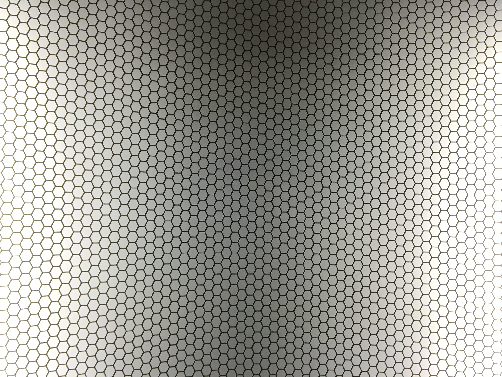

This is a placeholder for a first actual post on this new blog!

Here I'm introducing this blog to the world and promising to write many
more interesting things in the future.

This blog+site is built using Gatsby.
The Gatsby tooling and ecosystem is great so I'm using Gatsby's starter blog
template as a starting point for this one.

One big reason for using this technology is the ease with which different
colleagues can collaborate on a community-driven site. An example of this is
the blogging system.

This post is composed using markdown, a friendly format that empowers even the
least tech-savvy writer to, among other possibilities, include pictures, links
to other pages, and tables, and to distinguish section headers, image captions,
quotations, and code snippets from regular text --- all possible within a bare
bones text editor through the use of sensible conventions around punctuation
and spacing.

In addition to using markdown blog posts have a section called 'front matter'
at the top of each file, where a blog post title and date can be specified or
even a description of the blog post that can be used as a preview when linking
to the blog post from other pages, or used for SEO and Open Graph purposes.
If no description is added, the system will excerpt a section from the blog
post.

The
[source file for this post](https://raw.githubusercontent.com/Strangehill/gatsby-starter-blog/master/content/blog/hello-world/index.md)
, the
[Gatsby Documentation for Markdown Syntax](https://www.gatsbyjs.org/docs/mdx/markdown-syntax/)
and this
[overview and description of Markdown syntax](https://daringfireball.net/projects/markdown/syntax)
from markdown developer John Gruber, are good places to learn more about
markdown.

You can also reference the whole kitchen sink of markdown syntax with examples available at this
[Markdown guide](https://www.markdownguide.org/basic-syntax).

